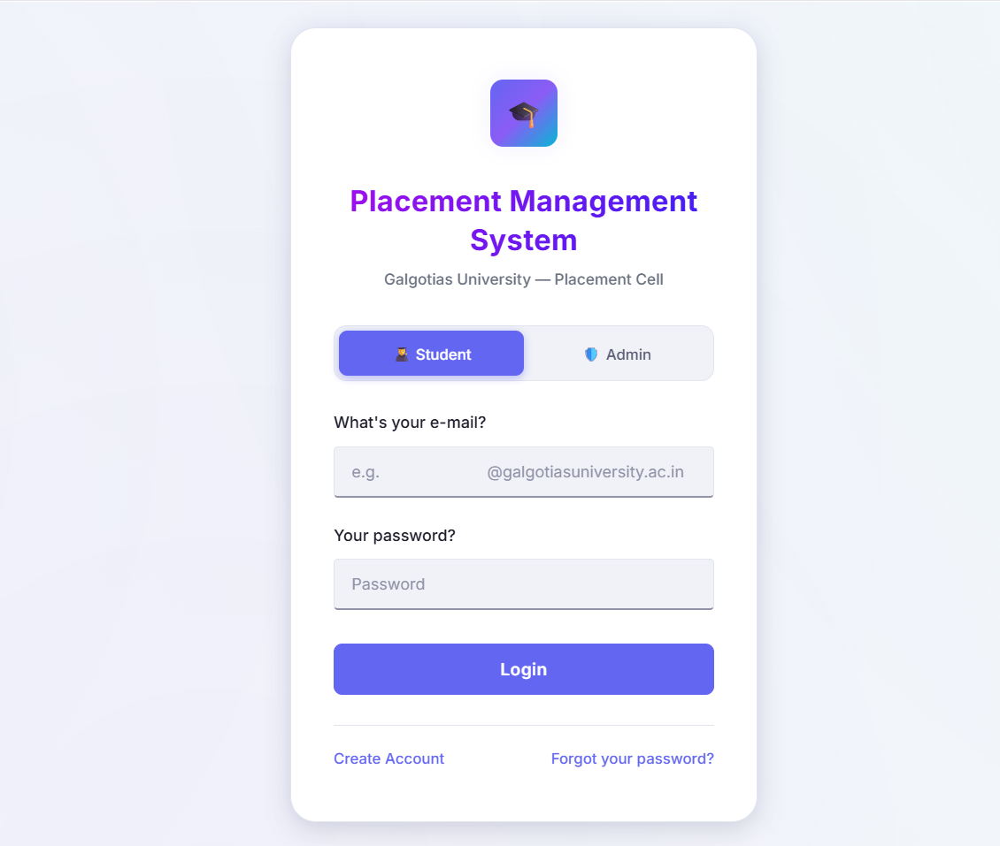
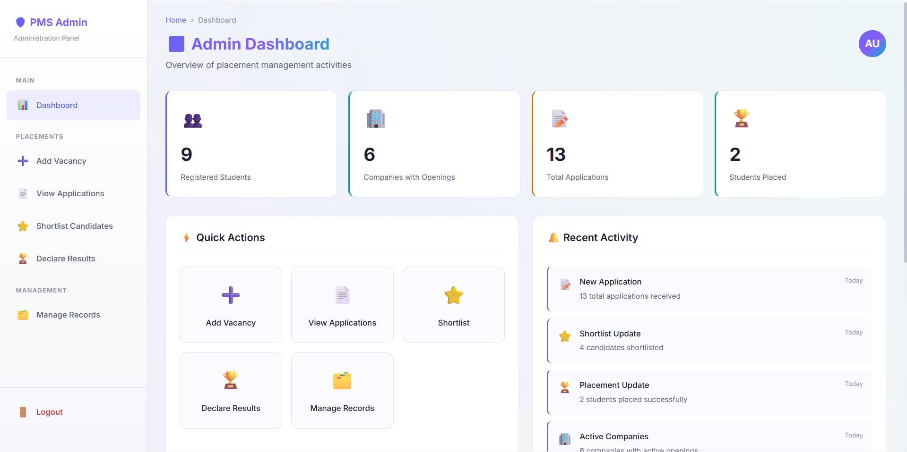
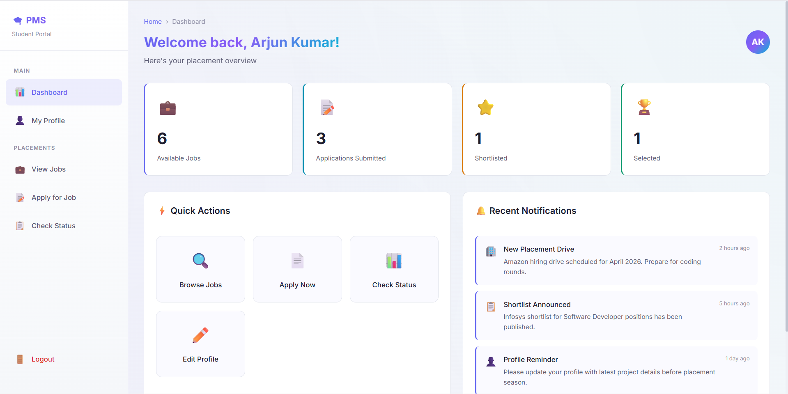

  # 🎓 Placement Management System 


A centralized Placement Management System that eliminates delays in job notifications by providing direct and real-time access to placement opportunities, removing dependency on manual communication chains like WhatsApp. 

---

## 📸 Screenshots

### 🔐 Login Page

> Secure role-based login for Students and Administrators.



### 🛡️ Admin Dashboard

> Overview of students, job postings, and application metrics.



### 🧑‍🎓 Student Dashboard

> Interface to explore jobs, apply, and track application status.



---

## ✨ Key Features

### 🧑‍🎓 Student Features

* Role-based login system
* View job opportunities
* Apply for jobs
* Track application status (Applied, Shortlisted, Selected, Rejected)
* Manage profile (academic details, skills, and profile picture upload)

### 🛡️ Admin Features

* Add and manage job vacancies
* Manage student records
* View and filter applications
* Shortlist candidates
* Declare final results

---

## 🛠️ Technologies Used

* **Frontend:** HTML5, CSS3, JavaScript
* **Storage:** Browser `localStorage` / `sessionStorage`
* **Design:** Responsive UI using Flexbox & modern CSS

---

## 🚀 How to Run

1. Clone the repository:

   ```bash
   git clone https://github.com/Arjun20569/placement-management-system.git  
   ```

2. Open project folder:

   ```bash
   cd placement-management-system
   ```

3. Run:

   * Open `index.html` in browser
   * OR use Live Server

---

## 🔐 Login Info

* Student Email Format: `username@galgotiasuniversity.ac.in` (or default `*@university.ac.in`)
* Admin Email Format: `admin@galgotiasuniversity.edu.in`

> ⚠️ Note: Email restriction and placeholders can be customized for my institution.

---

## 📂 Project Structure

```
placement-management-system/
│
├── doc_images/
├── Placement_Management_System_Report.docx 
├── README.md
├── add-vacancy.html
├── admin-dashboard.html
├── app.js
├── apply-job.html
├── check-status.html
├── declare-results.html
├── index.html
├── manage-records.html
├── shortlist-candidates.html
├── student-dashboard.html
├── student-profile.html
├── styles.css
├── view-applications.html
└── view-jobs.html
```

---

## 🚀 Future Enhancements

* Backend integration (Node.js / Flask)
* Database support (MySQL / MongoDB)
* Authentication system (JWT / Firebase)
* Resume upload feature
* Email notifications

---

## 📝 License

This project is developed for educational purposes as part of a Software Engineering course.

